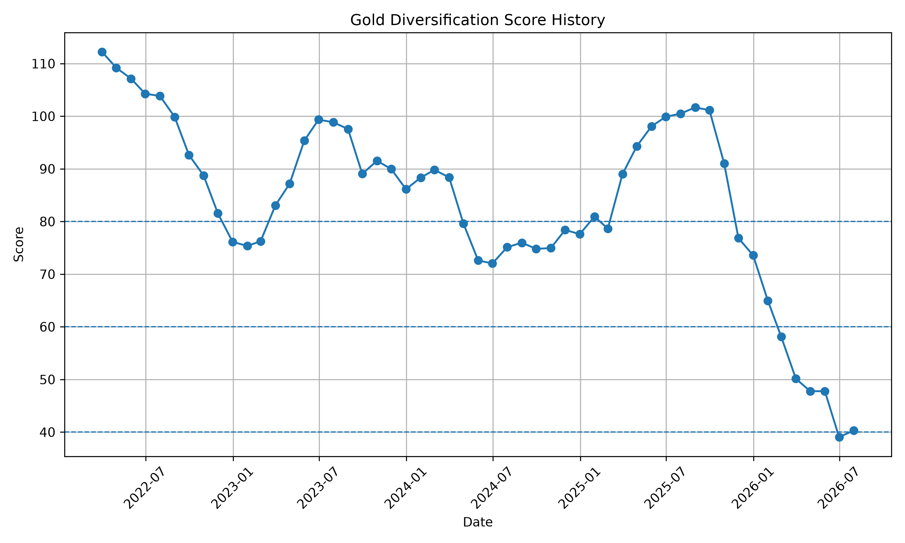
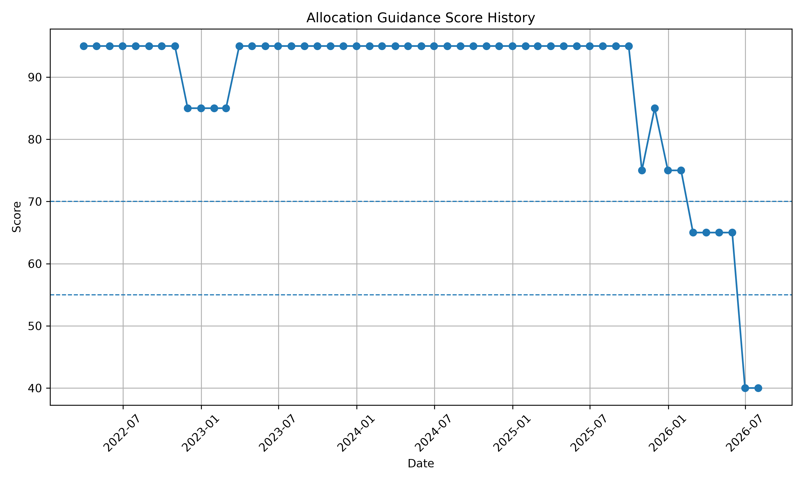
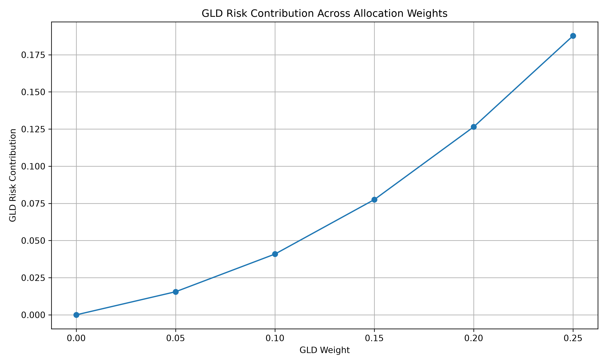

# Gold ETF Research Pack

## 1. Executive Summary
GLD still offers some diversification value, but current allocation conditions remain weak. The system supports only a limited strategic range of 0%–5%.

## 2. Current Diversification Condition
- Gold Diversification Score: 62.07/100
- Score Status: Moderate
- Alert Level: Red
- Diversification Trend: Improving

## 3. Current Allocation Decision
- Allocation Guidance Score: 40.00/100
- Allocation Stance: Defensive
- Recommendation Confidence: Low
- Recommended Strategic Range: 0%–5%
- Best Marginal Step: 0% to 5%

## 4. Why the Current Allocation Stance Looks This Way
The current allocation stance is constrained mainly by elevated alert level, weak allocation guidance score (40.00/100), high GLD/SPY volatility ratio (2.38), weak stress-period return support (-0.00%).

## 5. Historical Allocation Evidence
- Latest historical date: 2026-07-31
- Historical gold diversification score: 40.31/100
- Historical status: Mixed
- Historical alert level: Red
- Historical average GLD-equity correlation: 0.38
- Historical GLD/SPY volatility ratio: 2.38
- Historical stress return gap: -0.00%

## 6. Historical Trend Verdict
Historically, historical diversification score improved slightly; allocation conditions were broadly stable; supported allocation range remained at 0%–5%; alert level stayed at Red.

## 7. Charts

### Gold Diversification Score History

This chart tracks the historical diversification score. It helps show whether GLD's diversification condition is strengthening or weakening over time.

### Allocation Guidance Score History

This chart tracks the allocation guidance score over time. The latest defensive stance is consistent with a compressed allocation score and limited supported range.

### GLD Risk Budget Curve

This curve shows how GLD's share of total portfolio risk rises as its portfolio weight increases. A steep rise at higher weights suggests that GLD begins to consume disproportionate risk budget.

## 8. Method Note
This project treats GLD as a potential diversification sleeve inside a multi-asset ETF portfolio and evaluates it through four linked lenses: rolling correlation, relative volatility, stress-period performance, and allocation efficiency under different portfolio weights.

## 9. File Map
For deeper diagnostics, read:
- `reports/06_score_and_monitor/ai_risk_monitor_report.txt`
- `reports/06_score_and_monitor/diversification_alert.txt`
- `reports/weekly_reports/gold_weekly_memo.txt`
- `reports/06_score_and_monitor/allocation_history_summary.txt`
- `reports/06_score_and_monitor/gold_signal_dashboard.txt`
